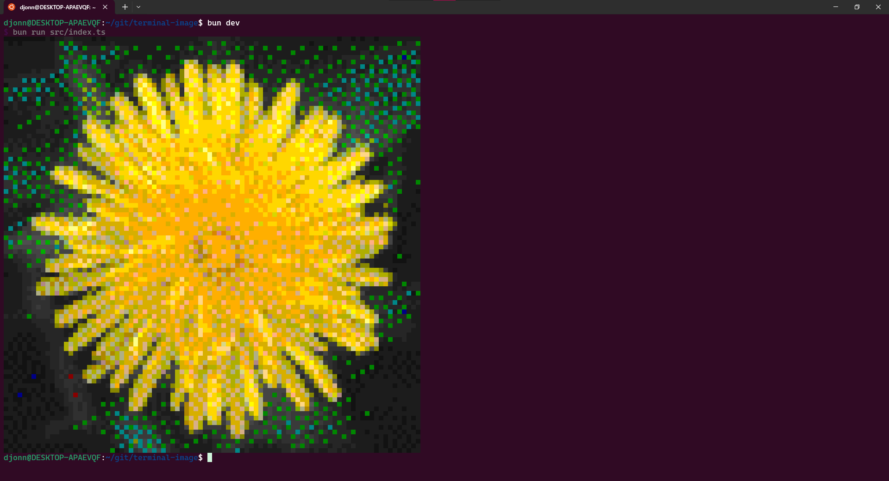

# Terminal image

Experimenting with turning images into terminal output.

## Running

To install dependencies:

```bash
bun install
```

To list available experiments:

```bash
bun dev
```

To run an experiment:

```bash
bun run src/experiments/double-precision-cat.ts
```

## Examples



