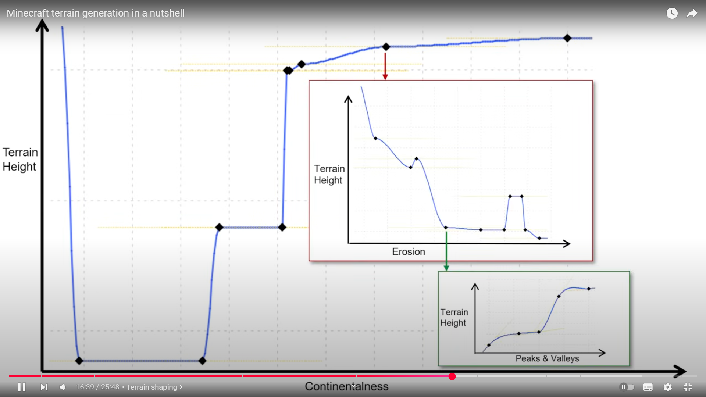

# Terrain generation

> Based on Henrik Knibergs video "[Minecraft terrain generation in a nutshell
](https://www.youtube.com/watch?v=CSa5O6knuwI)".


### Layered perlin noise (octaves)

Layer multiple perlin noise functions with different scaling (octaves) to get more interresting maps.
Each octave should have higher frequency, but lower applitude. Generally each higher octave has double the frequency and half the amplitude.


### Spline points

Use splines to map perlin noise.


### Combine noise layers

Minecraft uses:

- Continentalness
- Erosion
- Peaks and Valleys



### Biomes

Again uses perlin noise and spline points

- Temperature
- Humidity

They also use "wierdness", but Kniberg skips the explanation

Uses lookup tables to combine all 5 noise layers
Noise is split into 7 stages based on thresholds

```
{-1,     -0.78  } : Index 0
{-0.78,  -0.357 } : Index 1
{-0.357, -0.2225} : Index 2
{-0.2225, 0.05  } : Index 3
{ 0.05,   0.45  } : Index 4
{ 0.45,   0.55  } : Index 5
{ 0.55,   1     } : Index 6
```

Lookup tables in video:

* When in peaks Continentalness + Erosion determine what category of biome to use - [LINK](https://youtu.be/CSa5O6knuwI?t=1395)
* When in middle biomes Humidity and Temperature determine the specific biome (unless wierdness is involved) - [LINK](https://youtu.be/CSa5O6knuwI?t=1442)
